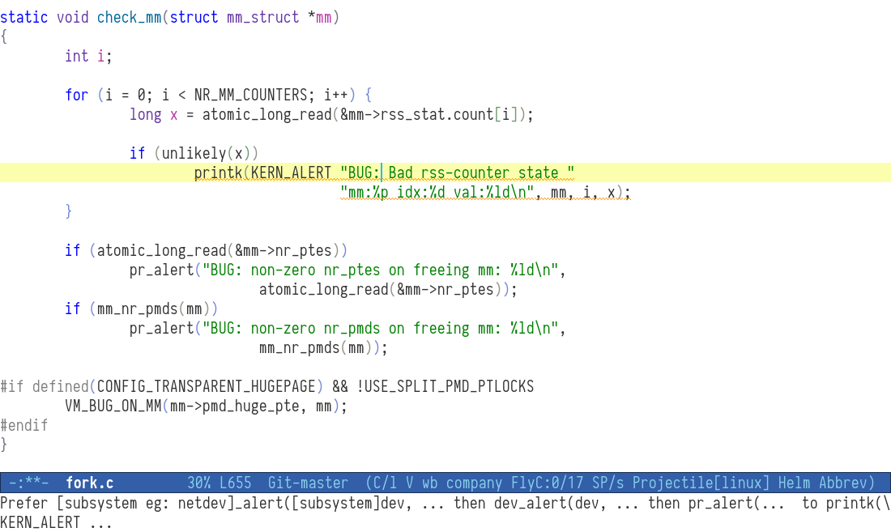

# flycheck-checkpatch

An easy way to write Linux kernel or QEMU code
according to the style guidelines.

## Usage
Add the following to your startup files:

```
  (eval-after-load 'flycheck
	'(add-hook 'flycheck-mode-hook #'flycheck-checkpatch-setup))
```

When enabled, flycheck highlights style issues
reported by the checkpatch.pl script.


